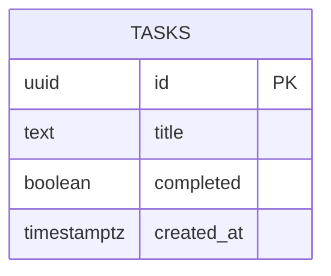
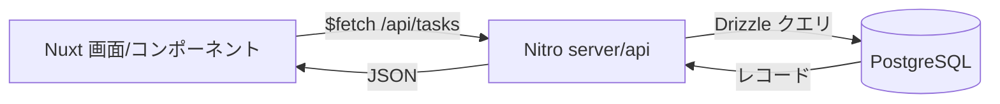

# データ仕様書

データモデルとスキーマを定義する。API のレスポンス形式は [`07-api-specification.md`](./07-api-specification.md) を参照。

## 目次

- [エンティティ一覧](#エンティティ一覧)
- [ER 図](#er-図)
- [エンティティ詳細](#エンティティ詳細)
- [スキーマ定義](#スキーマ定義)
- [データフロー](#データフロー)

## エンティティ一覧

| エンティティ | 説明 |
|------|------|
| tasks | タスク 1 件。本アプリの唯一のエンティティ |

## ER 図

リレーションを持たない単一テーブル構成。



## エンティティ詳細

### tasks

#### フィールド

| フィールド | 型 | 必須 | 説明 |
|-----------|----|------|------|
| id | uuid | ✓ | 主キー。サーバ生成（`gen_random_uuid()` / デフォルト） |
| title | text | ✓ | タスク名。1〜200 文字（アプリ側 zod 検証、[`06`](./06-security-specification.md)） |
| completed | boolean | ✓ | 完了フラグ。デフォルト `false` |
| created_at | timestamptz | ✓ | 作成日時。デフォルト `now()` |

#### インデックス・制約

- `id` を主キーとする。
- 一覧は `created_at` で並べる（件数が小さいため初期はインデックス追加なし。必要に応じて追加）。
- 文字数・空白の検証はアプリ層（zod）で行う（DB 制約は最小限）。

## スキーマ定義

Drizzle ORM の TypeScript スキーマ（`apps/web/server/db/schema.ts`）を単一の真実とし、
`drizzle-kit generate` で SQL マイグレーション（`apps/web/drizzle/`）を生成する。

```ts
// apps/web/server/db/schema.ts（実装イメージ）
import { pgTable, uuid, text, boolean, timestamp } from 'drizzle-orm/pg-core'

export const tasks = pgTable('tasks', {
  id: uuid('id').primaryKey().defaultRandom(),
  title: text('title').notNull(),
  completed: boolean('completed').notNull().default(false),
  createdAt: timestamp('created_at', { withTimezone: true }).notNull().defaultNow(),
})
```

マイグレーション適用は `pnpm db:migrate`（ローカル / CI 共通）。

## データフロー


